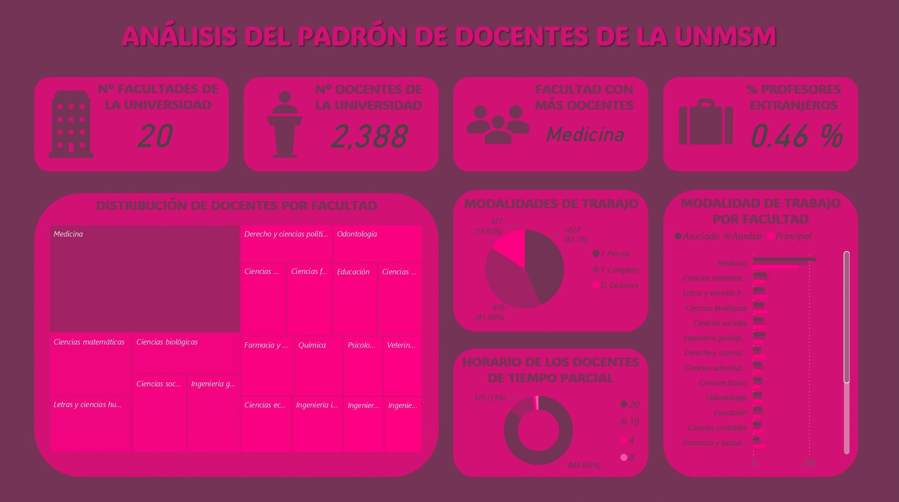
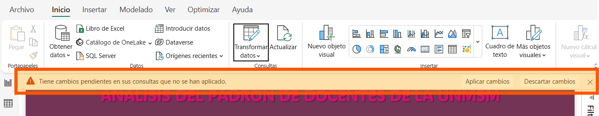

# *Análisis del padrón de docentes - UNMSM*




## 1. Descripción del proyecto
Este proyecto consiste en la extracción, limpieza, normalización y balanceo de los datos obtenidos del "Padrón de docentes de la UNMMSM". La finalidad de este trabajo es poner en práctica conceptos básicos para el curso "Minería de datos", así como realizar un análisis de este conjunto de docentes en base a su
modalidad de trabajo.

En este repositorio encontrará los archivos relacionados al proyecto, mas el detalle lo puede visualizar mediante el siguiente [enlace](https://www.notion.so/MD-Preprocesamiento-de-datos-1d6d0fe6d6cb80c8807fd5f6a76d420e?pvs=4).

## 2. Estado del proyecto


## 3. Tecnologías utilizadas


## 4. Guía de instalación
1. Agregar la extensión de ```Jupyter``` a su IDE de preferencia.

2. Clonar el repositorio en su IDE:
    ```
    https://github.com/caroSeminario23/Analisis-padron-docentes-unmsm.git
    ```

2. Crear un entorno virtual con ```Virtualenv```:
    ```
    cd C:\ruta\de\tu\proyecto
    python -m venv mi_entorno
    .\mi_entorno\Scripts\activate
    ```

3. Instalar el archivo de librerías:
    ```
    pip install -r requirements.txt
    ```

4. Modificar la ruta de origen de las fuentes del dashboard:
    - **Paso 1**  
        

    - **Paso 2**: Modificar la primera parte de la ubicación por la ubicación del repositorio en su sistema de archivos local. Mantener la segunda sin modificación alguna.  
        

    - **Paso 3**  
        

    - **Paso 4**  
        

## 5. Licencia
[](./LICENSE)